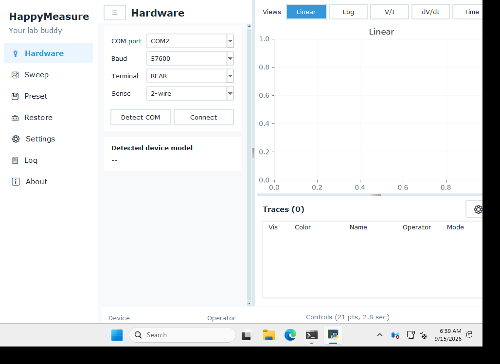
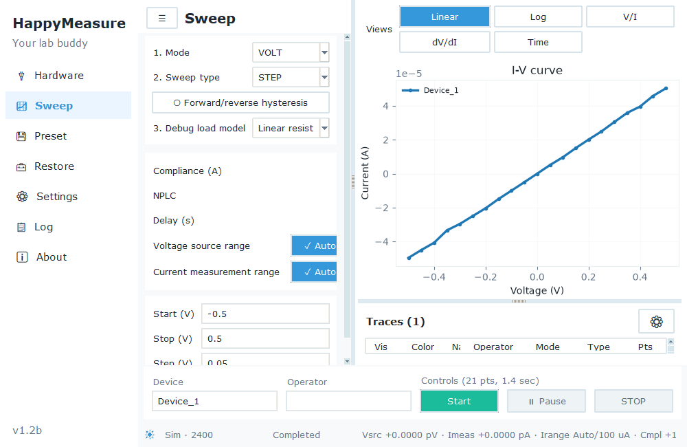
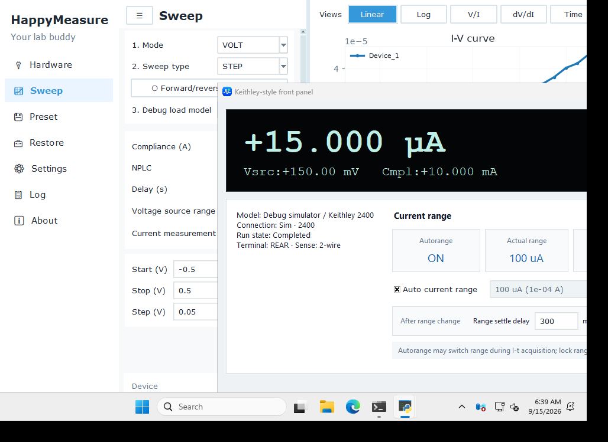
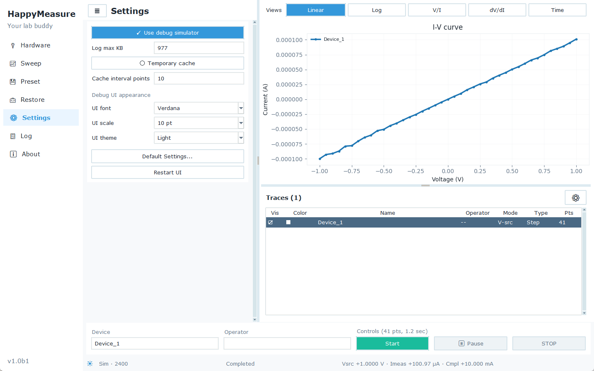

# HappyMeasure

HappyMeasure is a lightweight Windows-friendly Tkinter + Matplotlib measurement UI for Keithley 2400/2450-style IV workflows.

Current version: `1.1b4` (1.1 beta 4).

This Python project is inspired by the MIT-licensed MATLAB project
[Keith-IVt](https://github.com/Xiaolong-6/Keith-IVt). See `NOTICE.md`.

The product name and public Python package namespace are **HappyMeasure** / `happymeasure`. The historical `keith_ivt` namespace remains available as a compatibility layer, so existing imports and older local launch commands keep working during the migration.

## Start the app

Double-click:

```text
Run_HappyMeasure.bat
```

PowerShell alternative:

```text
.\Run_HappyMeasure.ps1
```

CLI launchers also support the public package namespace:

```text
python -m happymeasure
python -m happymeasure.hardware_preflight COM3 --baud 9600
```

The legacy `python -m keith_ivt` and `python -m keith_ivt.hardware_preflight` commands remain supported for compatibility.

## Screenshots

Hardware connection page using the debug simulator:



Completed simulator sweep with the I-V curve and trace list:



Keithley-style front-panel popup with current range control:



Settings page with simulator, cache, font, scale, and theme controls:



## What changed in 1.1b4

- Replaces the fixed Adaptive row table with a multiline `start, stop, step` editor. Ascending ranges use a positive step; descending ranges use a negative step.
- Adds an option to remove repeated scan values while preserving their first occurrence and scan order.
- Fixes missing requested setpoints during current-range changes by retrying transient readbacks at the same source value.
- Restores empty, invalid, or non-finite numeric inputs to their field defaults on focus loss and before starting a sweep.
- Makes each preset an exact snapshot of every visible Hardware and Sweep setting while leaving other pages unchanged.
- Preserves raw Adaptive segment text, duplicate handling, range Auto states, and the rest of the visible sweep configuration across settings, presets, and CSV metadata.
- Routes update-check results through the UI queue so closing the app while an update check is finishing cannot call a destroyed Tk interpreter.
- Adds a desktop user-flow smoke runner covering navigation, themes, simulator sweeps, Pause/Resume/STOP, expected validation failures, file output, and preset round trips.
- Keeps the 1.1b2 hysteresis sweep feature: optional forward/reverse hysteresis for finite Step and Adaptive sweeps, default OFF.
- Keeps the 1.1b1 startup updater path: Settings-controlled update checking, external updater handoff, preserved user settings/presets/logs/exports/backups/data, and active-sweep install blocking.
- Keeps the public launch namespace as `happymeasure` while retaining `keith_ivt` compatibility for existing scripts/imports.
- The operator has confirmed successful real-device measurement and the short
  hardware release gate with the final packaged `1.1b4` executable.

## Safe validation path

Install developer test tools first:

```text
python -m pip install -r requirements-dev.txt
```

Run simulator/unit validation first:

```text
python tests\run_full_validation.py
python -m pytest -q
python -m pytest --cov=keith_ivt -q
```

Run the hysteresis regression tests:

```text
python -m pytest tests/test_hysteresis_sweep_values.py tests/test_version_consistency.py -q
```

Run the update reminder tests:

```text
python -m pytest tests/test_update_check.py -q
```

Run release-hardening compatibility checks:

```text
python -m pytest tests/test_config_compatibility.py tests/test_trace_schema_contract.py tests/test_hardware_preflight_cli.py -q
```

Manual smoke checks are listed in `docs/MANUAL_SMOKE_TESTS.md`. Trace/export behavior is documented in `docs/TRACE_SCHEMA.md`; hardware preflight behavior is documented in `docs/HARDWARE_PREFLIGHT.md`.


Optional desktop-only Tk smoke test:

```powershell
$env:HAPPYMEASURE_RUN_TK_SMOKE="1"
python -m pytest tests\test_ui_smoke.py -q
```

## Real hardware preflight

Before real hardware, read:

```text
docs\HARDWARE_VALIDATION_PROTOCOL.md
```

Then run only the preflight:

```text
tools\hardware\Real_Hardware_Preflight.bat
```

The preflight opens the serial port, queries `*IDN?`, sends `:OUTP OFF`, and closes the port. It must not source voltage or current.

## Human developer handoff

This README is the human-facing handoff. Public documentation is in `docs/`.

## Current human-facing status

- Simulator workflows are the supported validation path.
- Real-device measurement and the final packaged-executable hardware release
  gate have been confirmed by the operator.
- The UI default is the clean `Light` theme; `Dark` is available; `Debug` is for layout inspection.
- Verdana is the preferred default UI font when installed. The font selector reads system-installed fonts.
- During an active measurement, the plot shows live data only; stored traces return after completion.
- Trace export/import/rename/delete actions live in the trace-list context menu. Plot right-click is for plot view/range/image actions.
- Trace visibility is display-only. **Export all traces** includes hidden traces; **Export visible** filters to ticked/visible traces only. Renamed traces are exported with their edited names.
- Step and Adaptive sweeps can optionally run forward then reverse through the same source values; the turn point is not duplicated. Time sweeps ignore hysteresis.
- The bottom status-bar connection/debug indicators are UI-scale-aware Canvas drawings, so they do not depend on Windows emoji fallback or the selected font family.
- Start is valid from `idle`, `stopped`, `completed`, and `aborted` ready states; repeated simulator runs should not require restarting the app.

## Developer architecture note

`src/keith_ivt/ui/simple_app.py` is intentionally kept as a compact composition root. Feature behavior should live in focused UI mixins/modules such as `update_controller.py`, `sweep_controller.py`, `hardware_controller.py`, and `trace_panel.py`. This keeps the Tkinter shell easier to validate and prevents the old monolithic UI file from growing back.

## Update checks

The app checks GitHub release metadata. An in-app update is offered only when
the official release asset includes a SHA-256 digest; the external updater
verifies that digest before replacing program files. If the release has no
verifiable digest, HappyMeasure opens the release page for a manual upgrade.
User settings, presets, logs, exports, backups, cache, and data are preserved.

## Where to look next

Human developer: start here, then use these files only as needed:

```text
CONTRIBUTING.md
docs\HARDWARE_VALIDATION_PROTOCOL.md
docs\HARDWARE_DRY_RUN_GUIDE.md
docs\WINDOWS_PORTABLE_BUILD.md
docs\RELEASE_CHECKLIST.md
docs\CHANGELOG.md
tests\README.md
```

## Windows portable app build

To build a version that runs on a Windows PC without requiring Python on the target machine, run from the project root:

```bat
tools\build\Build_Portable_Windows_App.bat
```

or:

```powershell
.\tools\build\Build_Portable_Windows_App.ps1
```

The outputs are `dist\HappyMeasure\HappyMeasure.exe` and
`dist\HappyMeasure-<version>-windows-portable.zip`. Distribute the generated
zip or the entire `dist\HappyMeasure` folder; do not copy only the exe. See
`docs/WINDOWS_PORTABLE_BUILD.md`.


### Windows build note: Python versions and temp permissions

The standard portable-app build script rejects stale or unsupported `.venv`
environments and rebuilds with Python 3.12, 3.11, or 3.13. Python 3.14 has a
separate script that skips full pytest during packaging and uses explicit
runtime/dev dependency installs with `PYTHONPATH=src` to avoid editable-install
temp-directory permission failures. If the build still fails, close any running
HappyMeasure/Python windows and rerun the matching script in `tools\build`.

## Windows portable build with Python 3.14

To build a Python-free portable Windows folder app using your installed Python 3.14, double-click:

```text
tools\build\Build_Portable_Windows_App_Python314.bat
```

The script also supports `.\tools\build\Build_Portable_Windows_App_Python314.ps1`.
It creates the same folder and versioned portable zip. See
`docs/WINDOWS_PYTHON314_BUILD.md`.

### Measurement safety note

Operator Stop/Abort is treated as a safety path. If a sweep is interrupted by the operator, HappyMeasure attempts to turn the SMU output off even when the normal-completion option would leave output enabled. A completed sweep still respects the configured `output_off_after_run` behavior.


### Simulator fault-injection safety tests

The debug simulator includes deterministic fault-injection hooks used by tests only. These hooks cover connect failures, read failures, non-finite readbacks, and output-off failures so the safety/error paths can be validated before real hardware testing. Normal UI simulator behavior is unchanged unless a test explicitly passes a `SimulatorFaultProfile`.

### Status icon rendering

The bottom status bar uses UI-scale-aware Canvas icons for connection/debug indicators instead of emoji glyphs. This avoids Windows/Tk emoji fallback problems where red/green lamps can render as monochrome or striped symbols. Status text and icons follow the selected UI scale; the icons do not depend on the selected font family.
