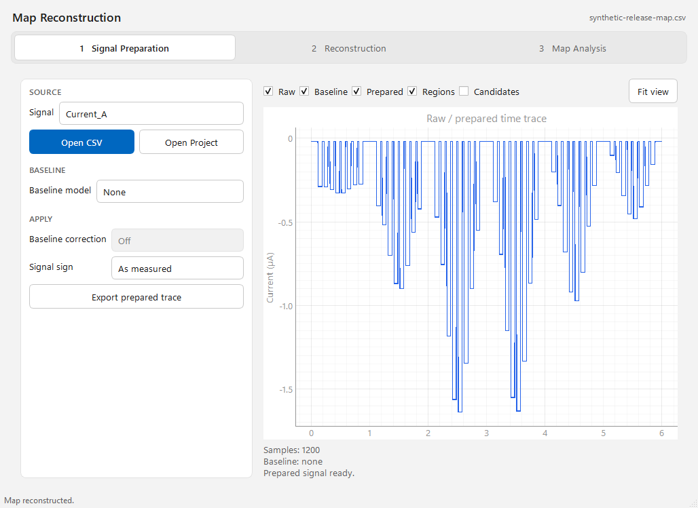
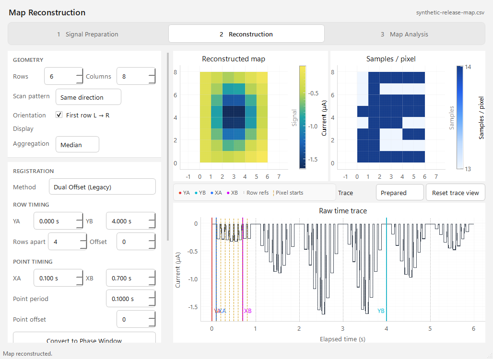
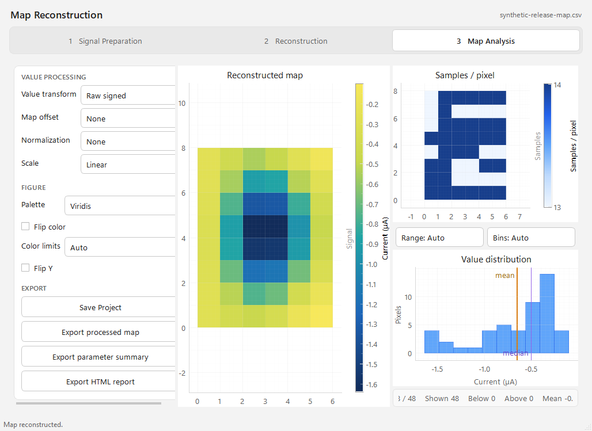

# HappyMeasure

HappyMeasure is a Windows-friendly Tkinter + Matplotlib measurement application for Keithley-style source-measure workflows, with an optional standalone Map Reconstruction application.

The public product/package names are **HappyMeasure** / `happymeasure`. The historical `keith_ivt` namespace remains supported as the internal/compatibility namespace.

The current release-candidate identity is frozen at **1.2b** through final screenshots, packaging, documentation, and release-only fixes so the version shown in the UI/screenshots matches the intended release. See `docs/VERSIONING.md`.

## Start HappyMeasure

From the repository root on Windows:

```text
Run_HappyMeasure.bat
```

or:

```powershell
.\Run_HappyMeasure.ps1
python -m happymeasure
```

Legacy `python -m keith_ivt` remains available for compatibility.

## Current development highlights

- Long-running Time plots support live display-only switching between **All data** and **Last N points** while a measurement is running; authoritative acquired/exported data remain complete.
- Constant-Time acquisition supports Standard/Fast/Custom profiles while preserving output-off safety and deterministic next-run configuration.
- Settings includes persistent automatic-backup and log-recording preferences, both defaulting to enabled.
- Developer-only UI and hardware diagnostics are grouped under **Show developer tools**; hardware diagnostics remain no-DUT/output-off-only.
- Serial **Detect COM** only enumerates Windows COM ports. It does not guess baud rates or send SCPI; the operator selects baud before Connect.
- Map Reconstruction provides Signal Preparation → Reconstruction → Map Analysis, self-contained `.hmmap` projects, processing/color controls, and a standalone portable build.
- The main-branch release gate now builds and audits both Windows portable ZIPs, smoke-launches the frozen executables, records SHA-256 values, and uploads the exact audited candidates as CI artifacts.

See `docs/RELEASE_NOTES_NEXT.md` for the current release draft and `docs/CHANGELOG.md` for historical releases.

## Standalone Map Reconstruction

Install optional GUI dependencies:

```powershell
python -m pip install -e ".[map]"
python -m map_reconstruction
```

`Run_Map_Reconstruction.bat` is the Windows launcher. Map Reconstruction imports HappyMeasure `single-v2` CSV files and supports self-contained `.hmmap` projects whose embedded source remains authoritative.

## Validation

Core validation:

```powershell
python -m pip install -e ".[dev]"
python -m pytest -q tests/common tests/happymeasure
```

Map Reconstruction release gate:

```powershell
python -m pip install -e ".[dev,map]"
$env:QT_QPA_PLATFORM="offscreen"
python -m pytest -q tests/map_reconstruction
```

After both dependency sets are installed:

```powershell
python tests\run_full_validation.py
```

Before using real hardware, read `docs/HARDWARE_VALIDATION_PROTOCOL.md`. Hardware preflight and Hardware Diagnostics must not source voltage/current or run a measurement.

## Hardware evidence scope

The current development line has passed a real Keithley MODEL 2401 no-DUT communication/control smoke including output-off verification, Standard/Fast acquisition, pause/resume, Stop/restart and SCPI-order checks. This evidence does **not** claim quantitative analog accuracy, passive-load validation, arbitrary DUT validation, or validation of every 2400-family model.

## Screenshots

The images below are part of the release documentation surface. Whenever visible UI changes, refresh the corresponding file from the frozen 1.2b source GUI before publication. Screenshots are illustrative UI evidence only; they are not hardware-validation evidence.

### HappyMeasure


### Map Reconstruction

The Map Reconstruction examples use a deterministic synthetic trace for illustration.







## Documentation

Start with `docs/README.md`. Important owner documents include:

- `docs/VALIDATION_STATUS.md`
- `docs/RELEASE_CHECKLIST.md`
- `docs/HARDWARE_VALIDATION_PROTOCOL.md`
- `docs/TRACE_SCHEMA.md`
- `docs/MAP_PROJECT_FORMAT.md`
- `docs/WINDOWS_PORTABLE_BUILD.md`
- `docs/VERSIONING.md`

## Windows portable build

After source validation passes:

```bat
tools\build\Build_Portable_Windows_App.bat
```

On `main`, CI also builds both Windows portable deliverables from the exact commit, audits package contents/privacy/size, smoke-launches both frozen executables, generates a SHA-256 manifest, and uploads the audited ZIPs as short-lived workflow artifacts.

Do not publish `build/`, `dist/`, caches, logs, local helper scripts, hardware-smoke artifacts, or files containing workstation-specific absolute paths. Release artifacts are built from the final release commit.

## Attribution

HappyMeasure is inspired by the MIT-licensed MATLAB project [Keith-IVt](https://github.com/Xiaolong-6/Keith-IVt). See `NOTICE.md`.
