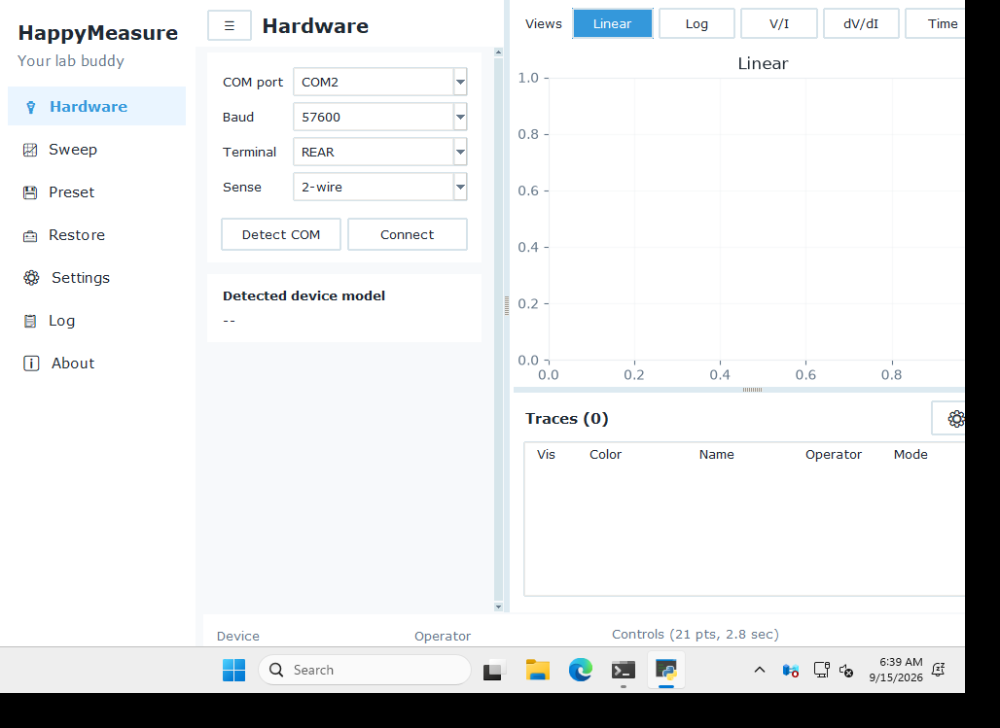
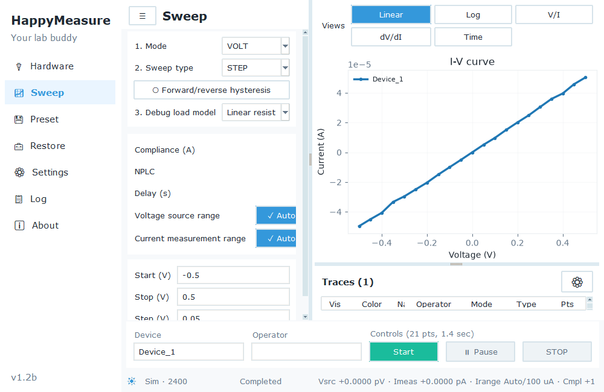
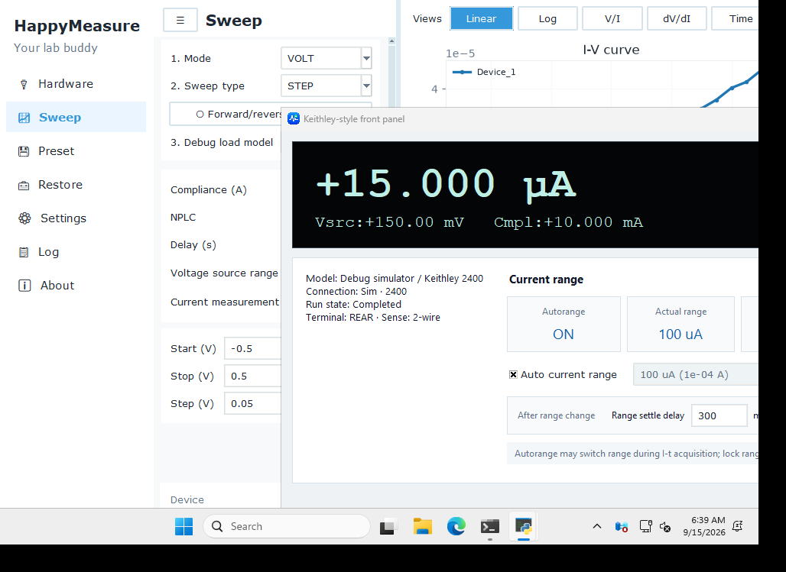

# HappyMeasure

HappyMeasure is a Windows-friendly Tkinter + Matplotlib measurement application for Keithley-style source-measure workflows.

The public product/package names are **HappyMeasure** / `happymeasure`. The historical `keith_ivt` namespace remains supported as the internal/compatibility namespace.

The current development identity is **1.2b2**. Public prerelease **v1.2b** is published and immutable; post-release development has resumed under the normal per-commit beta-serial policy. See `docs/VERSIONING.md`.

## Web project hub

The static HappyMeasure project hub is published through GitHub Pages:

- **Project hub:** https://xiaolong-6.github.io/HappyMeasure/
- **Map Reconstruction Web:** https://xiaolong-6.github.io/HM-Map-Reconstruction/
- **IV Fitter Web:** https://xiaolong-6.github.io/HM-IV-Fitter/

The browser analysis applications are independently developed and deployed in their own repositories. The former desktop Map Reconstruction application is no longer part of the HappyMeasure source tree or Windows package.

## Start HappyMeasure

From the repository root on Windows:

```text
Run_HappyMeasure.bat
```

or:

```powershell
.\Run_HappyMeasure.ps1
python -m happymeasure
```

Legacy `python -m keith_ivt` remains available for compatibility.

## Current development highlights

- A lightweight static project hub links the HappyMeasure desktop releases to the independently deployed Map Reconstruction and IV Fitter browser applications.
- Long-running Time plots support live display-only switching between **All data** and **Last N points** while a measurement is running; authoritative acquired/exported data remain complete.
- Constant-Time acquisition supports Standard/Fast/Custom profiles while preserving output-off safety and deterministic next-run configuration.
- Settings includes persistent automatic-backup and log-recording preferences, both defaulting to enabled.
- Developer-only UI and hardware diagnostics are grouped under **Show developer tools**; hardware diagnostics remain no-DUT/output-off-only.
- Serial **Detect COM** only enumerates Windows COM ports. It does not guess baud rates or send SCPI; the operator selects baud before Connect.
- The main-branch release gate builds, audits and smoke-launches the HappyMeasure Windows portable ZIP, records its SHA-256 value, and uploads the exact audited candidate as a CI artifact.

See `docs/RELEASE_NOTES_NEXT.md` for the next release draft and `docs/CHANGELOG.md` for published release history.

## Validation

Core validation:

```powershell
python -m pip install -e ".[dev]"
python -m pytest -q tests/common tests/happymeasure
```

Static project hub:

```powershell
python tools\web\check_static_site.py
```

Complete local source validation:

```powershell
python tests\run_full_validation.py
```

Before using real hardware, read `docs/HARDWARE_VALIDATION_PROTOCOL.md`. Hardware preflight and Hardware Diagnostics must not source voltage/current or run a measurement.

## Hardware evidence scope

The published v1.2b baseline passed a real Keithley MODEL 2401 no-DUT communication/control smoke including output-off verification, Standard/Fast acquisition, pause/resume, Stop/restart and SCPI-order checks. That evidence remains applicable while later changes do not alter the hardware I/O or safety boundary. It does **not** claim quantitative analog accuracy, passive-load validation, arbitrary DUT validation, or validation of every 2400-family model.

## Screenshots

The current screenshots document the published HappyMeasure desktop UI. Whenever visible UI changes for a future release, refresh the corresponding files from the exact final source candidate before publication. Screenshots are illustrative UI evidence only; they are not hardware-validation evidence.







## Documentation

Start with `docs/README.md`. Important owner documents include:

- `docs/VALIDATION_STATUS.md`
- `docs/RELEASE_CHECKLIST.md`
- `docs/HARDWARE_VALIDATION_PROTOCOL.md`
- `docs/TRACE_SCHEMA.md`
- `docs/WINDOWS_PORTABLE_BUILD.md`
- `docs/VERSIONING.md`

## Windows portable build

After source validation passes:

```bat
tools\build\Build_Portable_Windows_App.bat
```

On `main`, CI builds the HappyMeasure Windows portable deliverable from the exact commit, audits package contents/privacy, smoke-launches the frozen executable, generates a SHA-256 manifest, and uploads the audited ZIP as a short-lived workflow artifact.

Do not publish `build/`, `dist/`, caches, logs, local helper scripts, hardware-smoke artifacts, or files containing workstation-specific absolute paths. Release artifacts are built from the final release commit.

## Attribution

HappyMeasure is inspired by the MIT-licensed MATLAB project [Keith-IVt](https://github.com/Xiaolong-6/Keith-IVt). See `NOTICE.md`.
